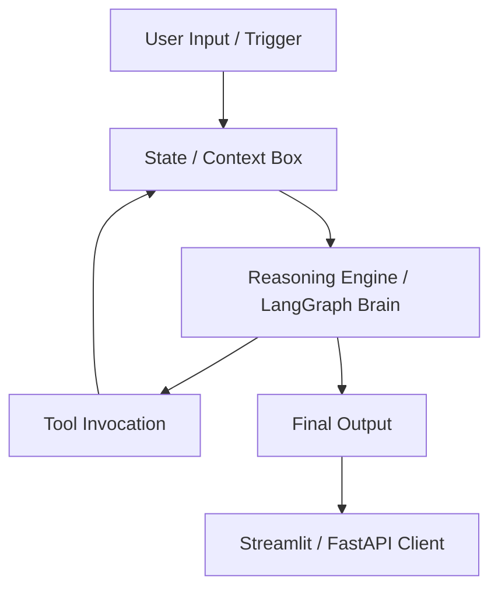

# High-Performance Autonomous Agent

[](https://www.python.org/)
[](https://langchain-ai.github.io/langgraph/)
[](https://groq.com/)
[](https://streamlit.io/)
[](LICENSE)

An autonomous multi-agent news intelligence system built on LangGraph, Groq, and Tavily that searches real-time news, analyzes it in parallel across specialized agents, and delivers a unified briefing through FastAPI and Streamlit.

## Table of Contents

- [1. System Architecture](#1-system-architecture)
- [2. Agent Core Breakdown](#2-agent-core-breakdown)
- [3. Tool Definition & Integration](#3-tool-definition--integration)
- [4. Operational Flow & Failure Modes](#4-operational-flow--failure-modes)
- [5. Quick Start & Production Deployment](#5-quick-start--production-deployment)
- [Project Structure](#project-structure)
- [API](#api)
- [Configuration](#configuration)
- [Extending the Project](#extending-the-project)
- [License](#license)

## 1. System Architecture

The system follows a centralized, hierarchical orchestration pattern.



Core architecture summary:

- Orchestration topology: centralized fan-out / fan-in using LangGraph `Send`.
- State management: a shared `NewsState` object carries the query and agent outputs across the graph.
- LLM configuration: Groq `llama-3.3-70b-versatile` with `temperature=0` for deterministic analysis.
- Delivery layer: FastAPI serves `/`, `/health`, and `/analyze`; Streamlit provides the interactive dashboard.

The workflow is defined in [graph/workflow.py](graph/workflow.py) and uses LangGraph's `Send` API to dispatch the same state to all agents in parallel.

## 2. Agent Core Breakdown

The project uses a team of specialized agents rather than a single monolithic assistant.

### Finance Agent

- System prompt / persona: financial market analyst focused on stock movement, macroeconomics, and investment themes.
- Memory depth: short-term only, inherited from the current graph state.
- Tools allowed: Tavily news search and Groq summarization.

### AI Agent

- System prompt / persona: AI industry analyst tracking models, startups, enterprise adoption, and product launches.
- Memory depth: short-term only, inherited from the current graph state.
- Tools allowed: Tavily news search and Groq summarization.

### Cyber Agent

- System prompt / persona: cybersecurity intelligence analyst covering attacks, vulnerabilities, ransomware, and threat trends.
- Memory depth: short-term only, inherited from the current graph state.
- Tools allowed: Tavily news search and Groq summarization.

### Startup Agent

- System prompt / persona: startup and venture capital analyst focused on funding, acquisitions, and ecosystem signals.
- Memory depth: short-term only, inherited from the current graph state.
- Tools allowed: Tavily news search and Groq summarization.

The shared state schema is defined in [graph/state.py](graph/state.py).

## 3. Tool Definition & Integration

The system uses a small, explicit tool surface instead of a large general-purpose tool ecosystem.

| Tool Name | Input Arguments | Description / Side-Effects |
| --- | --- | --- |
| `search_news` | `query: str`, `max_results: int = 5` | Queries Tavily for real-time news and returns ranked results. |
| `format_search_results` | `results: list` | Converts Tavily output into text for summarization. |
| `summarize_news` | `topic: str`, `articles: str` | Produces a concise summary with Groq. |
| `summarize_finance_news` | `articles: str` | Generates finance-focused analysis. |
| `summarize_ai_news` | `articles: str` | Generates AI-focused analysis. |
| `summarize_cyber_news` | `articles: str` | Generates cybersecurity-focused analysis. |
| `summarize_startup_news` | `articles: str` | Generates startup and VC-focused analysis. |

Implementation notes:

- Tavily access is initialized in [tools/tavily_search.py](tools/tavily_search.py).
- Groq access is initialized in [tools/summarizer.py](tools/summarizer.py) and in the agent modules.
- Environment variables are loaded with `python-dotenv`.

## 4. Operational Flow & Failure Modes

1. Initialization & state injection
   - The user submits a query through the API or Streamlit UI.
   - The system creates an initial `NewsState` with empty result arrays and an empty final report.

2. Reasoning & tool selection
   - The router fans the query out to the Finance, AI, Cyber, and Startup agents in parallel.
   - Each agent builds a domain-specific search query and calls Tavily.
   - Each agent then sends the aggregated content to Groq for summarization.

3. Validation & critique loop
   - The reducer checks whether each agent produced a usable summary.
   - If no results are available, the report falls back to a safe placeholder message.
   - The current implementation does not include a recursive self-critique chain or external evaluator.

4. State update & output delivery
   - The reducer merges the parallel outputs into a single `final_report`.
   - The API returns a structured JSON payload.
   - Streamlit renders the report and the per-agent summaries.

Failure modes to expect:

- Missing `GROQ_API_KEY` or `TAVILY_API_KEY` blocks startup.
- Network or API failures return empty search results or incomplete summaries.
- If `uvicorn` is launched from the wrong directory, imports may fail; use the repo-root command shown below.

## 5. Quick Start & Production Deployment

### Prerequisites

- Python 3.10 or newer
- A Groq API key
- A Tavily API key

### Local Setup

Windows PowerShell:

```powershell
python -m venv venv
.\venv\Scripts\Activate.ps1
pip install -r requirements.txt
```

Linux or macOS:

```bash
python -m venv venv
source venv/bin/activate
pip install -r requirements.txt
```

### Environment variables

Create a `.env` file in the project root using [env.example](env.example) as the starting point:

```env
GROQ_API_KEY=your_groq_api_key
TAVILY_API_KEY=your_tavily_api_key
```

### Run locally

Start both services together:

```powershell
.\run.ps1
```

Or start them individually:

```powershell
python -m uvicorn api.main:app --reload
```

```powershell
streamlit run ui\streamlit_app.py
```

### Minimal reproducible example

```python
from graph.workflow import run_news_analysis

def run_agent_pipeline(user_prompt: str):
    return run_news_analysis(user_prompt)["final_report"]

if __name__ == "__main__":
    result = run_agent_pipeline("Generate a fintech and cybersecurity briefing.")
    print(result)
```

### Production considerations

- Keep `temperature=0` for predictable reports.
- Add rate limiting and caching if traffic grows.
- Monitor Tavily and Groq usage to control token and request costs.
- If you add self-correction loops later, cap retries to avoid runaway token usage.
- Prefer `python -m uvicorn api.main:app` or the provided `run.ps1` to avoid import-path issues.

## Project Structure

```text
.
├── agents/
├── api/
├── graph/
├── prompts/
├── tools/
├── ui/
├── env.example
├── requirements.txt
├── run.ps1
└── README.md
```

Key files:

- [api/main.py](api/main.py) exposes the FastAPI backend.
- [ui/streamlit_app.py](ui/streamlit_app.py) provides the dashboard.
- [graph/workflow.py](graph/workflow.py) defines the parallel graph.
- [graph/reducer.py](graph/reducer.py) merges agent results.
- [graph/state.py](graph/state.py) defines the shared state model.
- [tools/tavily_search.py](tools/tavily_search.py) wraps Tavily news search.
- [tools/summarizer.py](tools/summarizer.py) centralizes Groq summarization helpers.
- [run.ps1](run.ps1) launches backend and frontend together.

## API

### GET /

Returns basic service status information.

### GET /health

Returns a simple health payload.

### POST /analyze

Runs the multi-agent news analysis pipeline.

Request body:

```json
{
  "query": "Latest AI and cybersecurity news"
}
```

Example response:

```json
{
  "success": true,
  "query": "Latest AI and cybersecurity news",
  "final_report": "...",
  "finance_results": [],
  "ai_results": [],
  "cyber_results": [],
  "startup_results": []
}
```

## Configuration

The Streamlit dashboard expects the backend at `http://localhost:8000/analyze` by default. If you change the port, update the sidebar URL in [ui/streamlit_app.py](ui/streamlit_app.py).

The current Groq model is `llama-3.3-70b-versatile` with zero temperature for all agent calls.

## Extending the Project

Common next steps include:

- Add new agents for legal, health, or politics coverage.
- Introduce a vector store for long-term memory.
- Add response caching for repeated queries.
- Add streaming output to the UI.
- Improve source attribution in the final briefing.
- Add more search providers or a ranking layer above Tavily.

For contribution guidance, issue workflow, and enhancement ideas, see [CONTRIBUTING.md](CONTRIBUTING.md).

# References


## License

This project is licensed under the MIT License. See [LICENSE](LICENSE) for details.
