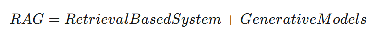
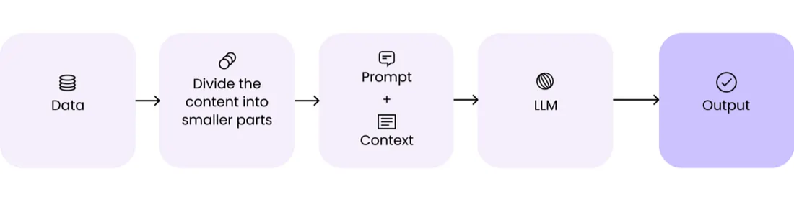
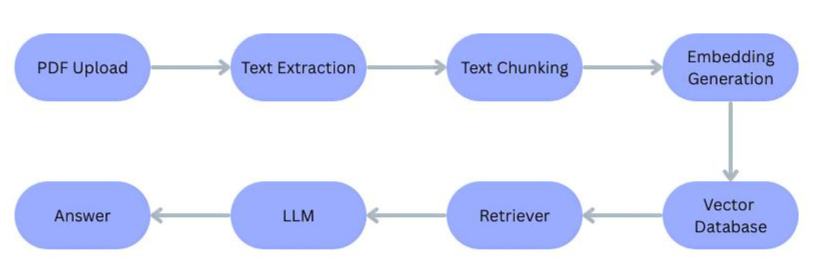
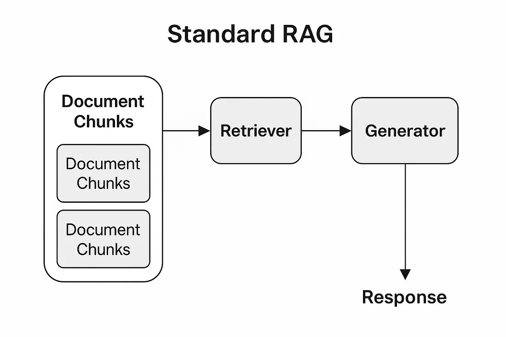

## PDF RAG Question Answering Platform

<!-- Badges: Tech Stack & Tools -->

*An AI system using Retrieval-Augmented Generation (RAG) to answer questions from your PDFs. It retrieves relevant document chunks using embeddings and cites sources, enabling factual and explainable responses.*

---

**Highlights**
- Upload PDFs and chat with their content.
- Local embeddings via `sentence-transformers` (`all-MiniLM-L6-v2`).
- Fast vector search using FAISS.
- LLM: LLaMA 3 (`meta-llama/Meta-Llama-3-70B-Instruct`) served via Hugging Face Inference API.
- Built with Streamlit + LangChain `ConversationalRetrievalChain`.

---

**Tech Stack**
- **UI**: Streamlit
- **Orchestration**: LangChain (`ConversationalRetrievalChain`, memory via `ConversationBufferMemory`)
- **Embeddings**: `sentence-transformers` (`all-MiniLM-L6-v2`)
- **Vector Store**: FAISS (CPU)
- **LLM**: Hugging Face Endpoint for `Meta-Llama-3-70B-Instruct`
- **PDF Parsing**: PyPDF2
- **Config**: `python-dotenv` with `.env`

---

*I built an AI system that uses Retrieval-Augmented Generation to answer questions from PDFs. Instead of relying purely on the LLM, it retrieves the most relevant document chunks using vector embeddings, ensuring factual and explainable responses.*

---

RAG-based AI PDF Question Answering system using LangChain, FAISS, and LLMs to enable accurate, source-grounded question answering over unstructured documents.

A Retrieval-Augmented Generation (RAG) system that allows users to:
- Upload PDF documents
- Ask natural language questions
- Receive accurate, source-grounded answers extracted from the PDFs

---

## SYSTEM PROCESS

---

## SYSTEM ARCHITECTURE

---

## RAG ARCHITECTURE

---

